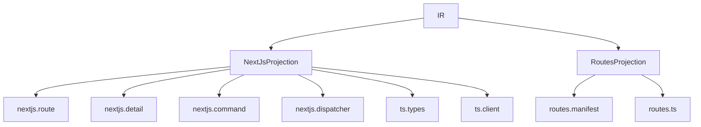

Projections are Manifest's code generation layer. They consume IR and emit artifacts, but they are not allowed to redefine what a Manifest program means.

## What This Concept Is

The projection contract is defined in `src/manifest/projections/interface.ts`. A projection takes an `IR` plus a request describing a surface and optional options, then returns artifacts and diagnostics. The built-in implementations are `NextJsProjection` in `src/manifest/projections/nextjs/generator.ts` and `RoutesProjection` in `src/manifest/projections/routes/generator.ts`.

This concept depends on [Compilation and IR](/docs/compilation-ir) because projections never parse source themselves. It also depends on the [Runtime Engine](/docs/runtime-engine-concepts) because generated write paths are expected to call `RuntimeEngine.runCommand()` rather than reimplement policy, constraint, or guard logic.



## How It Works Internally

`NextJsProjection.generate()` switches on `request.surface` and produces different artifacts for reads, writes, dispatcher routes, entity type declarations, and client helpers. The source keeps option normalization private, but the behavior is clear: `normalizeOptions()` applies defaults for auth provider, import paths, tenant filtering, soft-delete filtering, the app directory, and comment or indentation preferences.

Read and write generation are intentionally different. `_route()` and `_detail()` generate entity read handlers. `_command()` generates entity command handlers. `_dispatcher()` produces the canonical route shape at `/api/manifest/[entity]/commands/[command]`, which is the write path recommended throughout the repository. That split is not accidental; it mirrors the architecture note in `docs/patterns/usage-patterns.md` that reads may bypass the runtime while writes must go through it.

`RoutesProjection` serves a different goal. Instead of emitting framework code, it emits a canonical route manifest and typed path helpers. `buildRouteManifest()` derives read routes from entities, write routes from entity-owned commands, merges optional manual routes, sorts everything deterministically, and records collisions as diagnostics. `generateTypedPathBuilders()` then turns that manifest into helper functions such as `recipeListPath()` or `orderApprovePath()`.

Projection registration is handled by `src/manifest/projections/registry.ts`. The registry memoizes built-in registration on first access through `registerBuiltinProjections()` in `src/manifest/projections/builtins.ts`. That avoids silent startup-order bugs when tooling asks for a projection by name.

## Basic Usage

Generate a Next.js dispatcher directly from IR:

```ts
import { NextJsProjection } from '@angriff36/manifest/projections/nextjs';

const projection = new NextJsProjection();

const result = projection.generate(ir, {
  surface: 'nextjs.dispatcher',
  options: {
    authProvider: 'clerk',
    databaseImportPath: '@repo/database',
    runtimeImportPath: '@repo/manifest/runtime',
    responseImportPath: '@/lib/manifest-response',
  },
});

console.log(result.artifacts[0]?.pathHint);
```

## Advanced Usage

Generate a canonical route inventory and include manual routes:

```ts
import { RoutesProjection } from '@angriff36/manifest/projections/routes';

const projection = new RoutesProjection();

const result = projection.generate(ir, {
  surface: 'routes.manifest',
  options: {
    basePath: '/api',
    includeAuth: true,
    includeTenant: true,
    manualRoutes: [{
      id: 'health-check',
      path: '/api/health',
      method: 'GET',
      auth: false,
      tenant: false,
    }],
    generatedAt: '2026-05-22T00:00:00.000Z',
  },
});

console.log(JSON.parse(result.artifacts[0].code).routes);
```

<Callout type="warn">Do not treat generated read routes and generated write routes as equivalent surfaces. The code in `src/manifest/projections/nextjs/generator.ts` is explicit about the boundary: read projections can query storage directly, while write projections must preserve runtime semantics by routing through `RuntimeEngine.runCommand()`.</Callout>

<Accordions>
  <Accordion title="Why does Manifest allow read projections to bypass the runtime?">
    Reads often need different performance and pagination behavior than command execution, and the source tree explicitly frames projections as tooling rather than semantics. Letting generated read routes query storage directly keeps that path lightweight and framework-friendly. The trade-off is that read handlers do not automatically inherit runtime policy enforcement unless your application adds it. That is why the docs in this repository repeatedly separate read surfaces from the canonical write dispatcher.
  </Accordion>
  <Accordion title="What do you gain from deterministic route manifests and typed path builders?">
    `RoutesProjection` gives you a stable route inventory that can be diffed in CI, inspected by governance commands, and imported into client code as typed helpers. This reduces hardcoded string drift and makes transport contracts explicit. The trade-off is less framework magic: routes are derived from IR and options, not inferred from a folder scan or hidden conventions. For governed applications, that explicitness is usually a feature rather than a burden.
  </Accordion>
</Accordions>

## When to Use Which Projection

- Use `NextJsProjection` when you want generated application artifacts such as route handlers, a dispatcher, generated TypeScript entity types, or a simple client SDK.
- Use `RoutesProjection` when you need a deterministic route inventory, typed path builders, or governance-friendly route metadata.
- Use both when you want generated code in your app and a machine-readable transport contract for CI or tooling.

The [Next.js Projection Guide](/docs/guides/nextjs-projection) shows a full compile-and-generate workflow, and the [Projections API Reference](/docs/api-reference/projections) lists the exact surfaces, options, and import paths.
