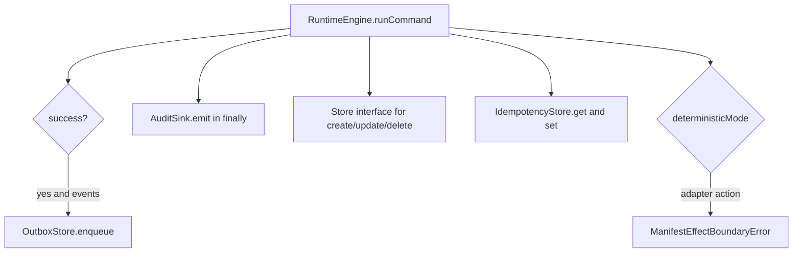

> **AUTO-GENERATED REFERENCE.** This file in `docs/codedocs/` is a
> code-derived reference snapshot of repository structure and signatures.
> It is intended for tooling (Context7, search indexers, etc.) and is
> NOT verified prose on every regeneration. For normative, hand-curated
> documentation see [`docs/spec/`](../../spec/) — in particular
> [`docs/spec/manifest-vnext.md`](../../spec/manifest-vnext.md) for language
> semantics and [`docs/spec/config/manifest.config.md`](../../spec/config/manifest.config.md)
> for projection configuration. Projections are described here as
> **tooling, not language semantics** — they consume IR and emit
> artifacts; they do not redefine policy/guard/constraint behaviour.

Manifest keeps the core runtime small by expressing integration points as explicit interfaces. Storage adapters, audit sinks, outbox stores, and idempotency stores are all opt-in contracts, which means you can change operational behavior without changing language semantics.

## What This Concept Is

The root runtime export in `src/manifest/runtime-engine.ts` defines `Store`, `IdempotencyStore`, `RuntimeOptions`, and the effect-boundary errors. Dedicated modules define the audit and outbox contracts: `src/manifest/audit/audit-sink.ts` and `src/manifest/outbox/outbox-store.ts`. First-party implementations live under `src/manifest/audit/sinks/*`, `src/manifest/outbox/stores/*`, and `src/manifest/stores.node.ts`.

This concept connects directly to the [Runtime Engine](runtime-engine-concepts.md) because `runCommand()` is where these contracts get called. It also influences [Projections](api-reference/projections.md), because generated handlers still need to construct runtime instances with the right adapters underneath.



## How It Works Internally

`RuntimeOptions.storeProvider` is the main storage extension point. `initializeStores()` in `src/manifest/runtime-engine.ts` first asks the provider for a store per entity. If it gets nothing back, it falls back to the built-in store targets from the IR. Browser-safe targets are handled in place, while server-only targets throw instructive errors that tell you to use `PostgresStore` or `SupabaseStore` from `src/manifest/stores.node.ts`.

Audit behavior is intentionally fail-open. If you pass `auditSink`, `runCommand()` generates a `recordId` and timestamp before doing any work, then calls `emitAudit()` in a `finally` block. The sink gets exactly one `AuditRecord` per invocation, even when the command fails or throws. If the sink itself throws, the runtime logs a warning and does not alter the `CommandResult`.

Outbox behavior is similar but only occurs after a successful command with emitted events. `enqueueOutbox()` maps emitted runtime events into `OutboxEntry` objects and calls `outboxStore.enqueue()`. The first-party `MemoryOutboxStore` and `PostgresOutboxStore` both support claiming and marking delivery, but the runtime currently does not open a shared transaction across mutation and outbox enqueue. That gap is documented in `docs/spec/adapters.md` and visible in the source comments around `enqueueOutbox()`.

Idempotency is separate from audit and outbox. If `idempotencyStore` is configured, `runCommand()` requires an `idempotencyKey`, checks the cache before command evaluation, and stores both success and failure results afterward. This keeps retry semantics explicit and consistent.

## Basic Usage

Use a custom store provider when the root runtime needs server-backed storage:

```ts
import { RuntimeEngine } from '@angriff36/manifest';
import { PostgresStore } from '@angriff36/manifest/stores';

const runtime = new RuntimeEngine(
  ir,
  { tenantId: 'tenant-1' },
  {
    storeProvider: (entityName) => {
      if (entityName === 'Invoice') {
        return new PostgresStore({
          connectionString: process.env.DATABASE_URL!,
          tableName: 'invoices',
        });
      }

      return undefined;
    },
  },
);
```

## Advanced Usage

Combine audit and outbox delivery for governed command execution:

```ts
import { Pool } from 'pg';
import { RuntimeEngine } from '@angriff36/manifest';
import { PostgresAuditSink } from '@angriff36/manifest/audit/postgres';
import { PostgresOutboxStore } from '@angriff36/manifest/outbox/postgres';

const pool = new Pool({ connectionString: process.env.DATABASE_URL });

const runtime = new RuntimeEngine(
  ir,
  {
    actorId: 'approver-1',
    requestId: 'req-100',
    source: 'route',
    tenantId: 'tenant-1',
    user: { id: 'approver-1', role: 'admin' },
  },
  {
    auditSink: new PostgresAuditSink({ pool }),
    outboxStore: new PostgresOutboxStore({ pool }),
    generateId: () => crypto.randomUUID(),
  },
);
```

<Callout type="warn">The current runtime does not provide a shared transaction handle to both state mutation and outbox enqueue. If `outboxStore.enqueue()` fails after a successful mutation, the state change remains committed and the runtime only logs the failure. Treat that as an operational constraint until the transaction boundary is widened.</Callout>

<Accordions>
  <Accordion title="Why are audit and outbox failures fail-open?">
    Manifest treats audit and outbox as observability and delivery extensions, not as part of the core domain success path. `emitAudit()` and `enqueueOutbox()` both catch adapter errors and log warnings instead of rewriting the returned `CommandResult`. The upside is that a flaky sink does not make every command unavailable. The downside is that operators need monitoring around those warnings because a successful command does not guarantee durable side-channel delivery.
  </Accordion>
  <Accordion title="What is the trade-off in separating browser-safe runtime code from Node-only adapters?">
    Keeping `runtime-engine.ts` browser-safe means the root import can be used in browsers, tests, and lightweight tooling without dragging in Node dependencies such as `pg`. The cost is a two-step mental model: core runtime features live in the root package, while server adapters come from subpaths like `@angriff36/manifest/stores` or `@angriff36/manifest/outbox/postgres`. In practice, that trade-off is worth it because it preserves portability and keeps bundlers predictable. It also makes server-specific decisions explicit in application code rather than hidden in the runtime.
  </Accordion>
</Accordions>

## First-Party Adapter Modules

- `@angriff36/manifest/stores` exports `PostgresStore` and `SupabaseStore`.
- `@angriff36/manifest/audit` exports the `AuditSink` contract and `AuditRecord` shape.
- `@angriff36/manifest/audit/memory` and `@angriff36/manifest/audit/postgres` export concrete sink implementations.
- `@angriff36/manifest/outbox` exports the `OutboxStore` contract and `OutboxEntry` shape.
- `@angriff36/manifest/outbox/memory` and `@angriff36/manifest/outbox/postgres` export concrete outbox implementations.

For signatures, constructor options, and method-level examples, continue to [Adapters API Reference](api-reference/adapters.md).
