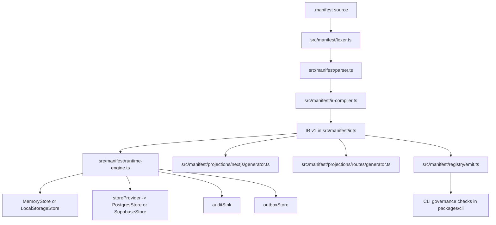
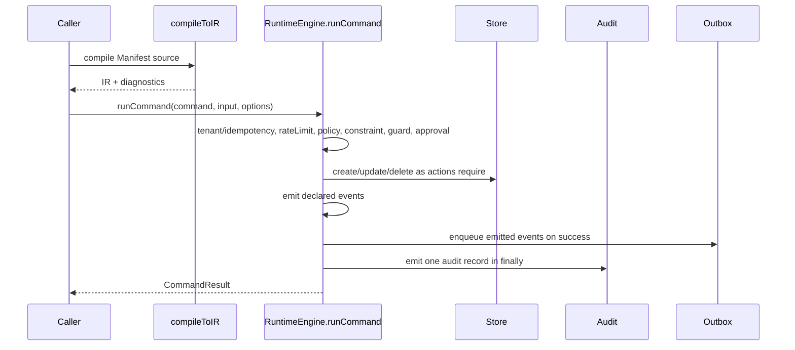

> ~~**AUTO-GENERATED REFERENCE.** This file in `docs/codedocs/` …~~
>
> **Correction (2026-07-15) @RYANSIGNED:** This page lives at
> `docs/reference/architecture.md` (not `docs/codedocs/`). Treat it as
> advisory architecture prose. Normative semantics remain in
> [`docs/spec/`](../spec/) — especially
> [`docs/spec/manifest-vnext.md`](../spec/manifest-vnext.md) and
> [`docs/spec/semantics.md`](../spec/semantics.md). Package pin SoT:
> `package.json` = **3.6.41**.

Manifest is organized around one central contract: the IR defined in `src/manifest/ir.ts`. Everything else either produces that contract, consumes it, or validates drift around it.

## Structural Overview

The front of the pipeline is conventional compiler architecture. `src/manifest/lexer.ts` tokenizes normalized source and keeps a single reserved-word list. `src/manifest/parser.ts` turns those tokens into AST nodes such as `EntityNode`, `CommandNode`, `PolicyNode`, and `ConstraintNode`, all defined in `src/manifest/types.ts`. `src/manifest/ir-compiler.ts` then lowers the AST into the runtime-facing IR, expands entity-scoped stores and policies, adds provenance metadata, and computes a deterministic hash.

The runtime layer is intentionally split. `src/manifest/runtime-engine.ts` is browser-safe and only includes in-memory and `localStorage` persistence. Server-only adapters such as `PostgresStore` and `SupabaseStore` live in `src/manifest/stores.node.ts` and are injected through `RuntimeOptions.storeProvider`. That split is a deliberate design decision: the package root stays safe to import in browser environments, while server applications can opt into Node dependencies only when needed.

On the output side, Manifest treats projections as tooling, not semantics. The projection contract in `src/manifest/projections/interface.ts` says projections consume IR and return artifacts plus diagnostics. `src/manifest/projections/nextjs/generator.ts` emits Next.js read routes, command routes, a canonical dispatcher, generated entity types, and a small client SDK. `src/manifest/projections/routes/generator.ts` emits a deterministic route manifest and typed path builders. Neither projection is allowed to redefine runtime behavior.

## Key Design Decisions

### The IR is the load-bearing contract

The most important decision is that Manifest does not execute the AST directly. `IRCompiler.transformProgram()` in `src/manifest/ir-compiler.ts` produces an `IR` object with explicit arrays for modules, entities, stores, events, commands, and policies. That keeps the runtime and projections decoupled from parser details. It also gives the CLI and governance commands a single shape to validate, diff, and inventory.

### Runtime semantics are fixed, transport is not

`RuntimeEngine.runCommand()` in `src/manifest/runtime-engine.ts` treats command execution as a deterministic pipeline. ~~It does the tenant gate before idempotency writes, resolves the command from IR, checks policies, evaluates command constraints, runs guards in order, executes actions, and then emits declared events.~~

> **Correction (2026-07-15) @RYANSIGNED:** Normative order
> (`docs/spec/semantics.md`): build eval context (with parameter defaults /
> trusted-source injection) → command `rateLimit` → policies (incl. policy
> `rateLimit`) → command constraints → guards → **approval gate** (when an
> entity `approval` targets the command) → actions → emits → `CommandResult`.
> Tenant / idempotency gates still apply around this pipeline as implemented
> in `runtime-engine.ts`.

The runtime accepts data, context, and options; it does not assume HTTP, a framework, or a database library. That is why the canonical dispatcher emitted by the Next.js projection is a projection concern, not a runtime concern.

### Adapters extend the runtime without changing the language

Storage, audit, and outbox concerns are implemented as explicit interfaces instead of framework magic. `Store`, `AuditSink`, `OutboxStore`, and `IdempotencyStore` are all defined as contracts in source. The runtime uses them, but it does not hardcode a persistence or logging stack. That is why memory and PostgreSQL adapters can share one execution model, and why the CLI can perform governance checks without being coupled to a live app.

### Registries and route manifests are machine-readable governance surfaces

`src/manifest/registry/emit.ts` emits command and entity registries from IR. `src/manifest/projections/routes/generator.ts` emits a canonical route manifest and typed path builders. The CLI in `packages/cli/src/index.ts` wires those into commands such as `manifest routes`, `manifest emit registries`, and `manifest audit-governance`. This is a practical choice: governance rules become testable against generated inventories instead of inferred from application code.

## Data and Request Lifecycle

A few details in the source are especially important. `RuntimeEngine` builds an evaluation context that includes `self`, `this`, `user`, and `context`. Relationship traversal is lazy: member access on `self.someRelation` can trigger `resolveRelationship()`, which consults stores and memoizes the result for the current command execution. Constraint overrides can emit synthetic `OverrideApplied` events, and optimistic concurrency can emit `ConcurrencyConflict` events. All of that happens inside the same runtime object, not in generated code.

## How the Pieces Fit Together

In practice, you use Manifest in one of two modes. The first is embedded runtime mode: you compile source to IR, instantiate `RuntimeEngine`, wire stores and adapters, and call `runCommand()` yourself. The second is projection mode: you compile source to IR, feed the IR into `NextJsProjection` or `RoutesProjection`, and write the returned artifacts into your app. The CLI in `packages/cli` automates both flows, but the code paths still route through the same compiler, IR, runtime, and projection modules described above.

The pages that follow go deeper into each of those layers: [Compilation and IR](compiler-ir.md), [Runtime Engine](runtime-engine.md), [Adapters and Delivery](../spec/adapters.md), and [Projections](../projections/README.md).
