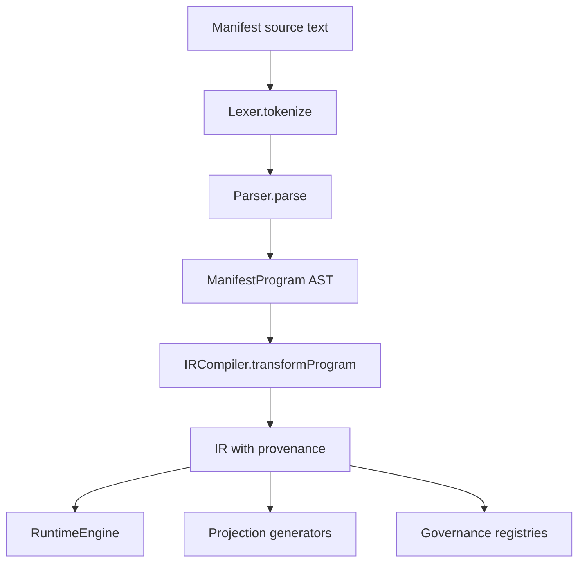

> ~~**AUTO-GENERATED REFERENCE.** This file in `docs/codedocs/` …~~
>
> **Correction (2026-07-15) @RYANSIGNED:** This page lives at
> `docs/reference/compiler-ir.md` (not `docs/codedocs/`). Advisory compiler/IR
> tour; normative contract is [`docs/spec/ir/ir-v1.schema.json`](../spec/ir/ir-v1.schema.json)
> plus [`docs/spec/semantics.md`](../spec/semantics.md). Package pin SoT:
> `package.json` = **3.6.4**.

Compilation is the boundary between Manifest's language syntax and everything that runs after it. The compiler does not just validate source text; it turns the text into a stable intermediate representation that runtime execution, projections, and governance tooling can all consume consistently.

## What This Concept Is

The compiler pipeline starts in `src/manifest/lexer.ts`, moves through `src/manifest/parser.ts`, and ends in `src/manifest/ir-compiler.ts`. The output is the `IR` interface defined in `src/manifest/ir.ts`. That IR exists so Manifest does not have to couple runtime logic, projection generation, or CLI tooling to parser internals. Once you have IR, every downstream part of the system can operate on one contract instead of many partial views.

This concept is tightly related to the [Runtime Engine](runtime-engine.md) and [Projections](../projections/README.md). The runtime uses IR commands, policies, entities, events, and stores directly. Projections use the same IR to generate route handlers and typed artifacts. The CLI also uses IR for validation and route or registry inventory.



## How It Works Internally

`Lexer` in `src/manifest/lexer.ts` normalizes line endings and tokenizes identifiers, strings, numbers, operators, and punctuation. One source-level detail matters a lot: the `KEYWORDS` set is the authoritative reserved-word list. The parser relies on that list to decide whether a token is an identifier or a language keyword, which keeps lexical and syntactic behavior consistent.

`Parser.parse()` in `src/manifest/parser.ts` consumes those tokens into a `ManifestProgram`. It recognizes top-level modules, entities, commands, policies, stores, and events. Inside entities, it also parses computed properties, relationships, transitions, constraints, and default policies. The parser does more than syntax recognition: for computed properties, `extractDependencies()` walks the expression tree and records referenced fields so the runtime can later evaluate computed values in dependency order.

`IRCompiler.compileToIR()` in `src/manifest/ir-compiler.ts` is where Manifest becomes operational. It replays parser diagnostics, lowers AST nodes into IR shapes, expands entity-scoped stores into `IRStore[]`, expands entity commands into `IRCommand[]`, attaches inherited default policies, and collects entity-scoped policies into the flat `IRPolicy[]` array. It then creates provenance metadata, computes a content hash for the source, computes a canonical IR hash, and returns both as part of `ir.provenance`.

The compiler also includes a cache hook. `IRCompiler` accepts an optional `IRCache`, and `compileToIR()` defaults to using `globalIRCache` from `src/manifest/ir-cache.ts`. If `useCache` is enabled, the compiler hashes the source text first and reuses the previously compiled IR when possible. That keeps repeated compile calls cheap without changing the IR contract.

## Basic Usage

Compile source directly with the public helper:

```ts
import { compileToIR } from '@angriff36/manifest/ir-compiler';

const source = `
entity Ticket {
  property required id: string
  property status: string = "open"
}

store Ticket in memory
`;

const { ir, diagnostics } = await compileToIR(source);

if (!ir) {
  console.error(diagnostics);
} else {
  console.log(ir.entities[0].name);
  console.log(ir.stores[0].target);
}
```

## Advanced Usage

Use the `IRCompiler` class when you want cache control or repeated compilation under one object:

```ts
import { IRCompiler } from '@angriff36/manifest/ir-compiler';

const compiler = new IRCompiler();

const first = await compiler.compileToIR(source, { useCache: true });
const second = await compiler.compileToIR(source, { useCache: false });

console.log({
  cachedEntities: first.ir?.entities.length,
  uncachedHash: second.ir?.provenance.irHash,
});
```

<Callout type="warn">Do not treat the AST exported by `@angriff36/manifest/compiler` as the runtime contract. The runtime, projections, and governance tooling are all built around `@angriff36/manifest/ir`, and hand-editing IR or depending on parser-only node shapes will create drift quickly.</Callout>

<Accordions>
  <Accordion title="Why use a canonical IR instead of executing the AST directly?">
    Executing the AST directly would make the runtime depend on every parser detail, including node variants that only matter during parsing. Manifest avoids that by flattening semantics into `IR`, which is easier to hash, serialize, diff, validate, and feed into other tools. The trade-off is that the compiler has to do more work up front, such as expanding entity-scoped policies and commands into explicit IR arrays. In return, downstream tools stay smaller and more stable because they all speak the same data model.
  </Accordion>
  <Accordion title="What is the trade-off in provenance hashing and verification?">
    Provenance makes the IR tamper-evident and gives the runtime something concrete to verify in production. `src/manifest/ir-compiler.ts` computes both a source content hash and a canonical IR hash, and `RuntimeEngine.verifyIRHash()` recomputes that same hash later. The benefit is integrity and drift detection. The cost is that build outputs become part of the operational contract, so if you patch IR by hand or regenerate with a different compiler version, verification can and should fail.
  </Accordion>
</Accordions>

## Related Types

The `@angriff36/manifest/ir` subpath exports the contract the compiler returns. The most important shapes are:

```ts
export interface IR {
  version: '1.0';
  provenance: IRProvenance;
  modules: IRModule[];
  values: IRValueObject[];
  entities: IREntity[];
  enums: IREnum[];
  stores: IRStore[];
  events: IREvent[];
  commands: IRCommand[];
  policies: IRPolicy[];
}

export interface CompileToIRResult {
  ir: IR | null;
  diagnostics: IRDiagnostic[];
}
```

If you want the full public signatures, continue to [Compiler and IR API Reference](compiler-ir.md) and [Types](types.md).
