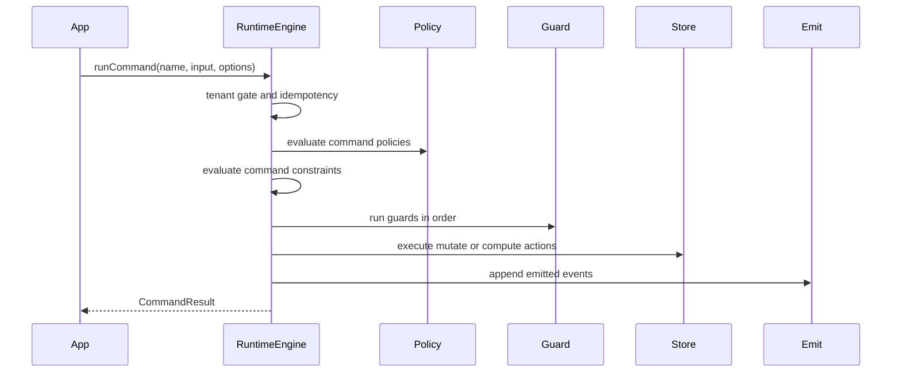

> **AUTO-GENERATED REFERENCE.** This file in `docs/codedocs/` is a
> code-derived reference snapshot of repository structure and signatures.
> It is intended for tooling (Context7, search indexers, etc.) and is
> NOT verified prose on every regeneration. For normative, hand-curated
> documentation see [`docs/spec/`](../spec/) — in particular
> [`docs/spec/manifest-vnext.md`](../spec/manifest-vnext.md) for language
> semantics and [`docs/spec/config/manifest.config.md`](../spec/config/manifest.config.md)
> for projection configuration. Projections are described here as
> **tooling, not language semantics** — they consume IR and emit
> artifacts; they do not redefine policy/guard/constraint behaviour.


`RuntimeEngine` is the execution core of Manifest. It takes compiled IR, a runtime context, and optional adapters, then applies a fixed command lifecycle that the rest of the package depends on.

## What This Concept Is

The runtime exists to make Manifest programs executable without leaking framework assumptions into domain logic. In source terms, it lives in `src/manifest/runtime-engine.ts` and is exported from the package root as `@angriff36/manifest`. It knows how to initialize stores, resolve entities and commands from IR, evaluate expressions, mutate instances, enforce policies and guards, emit events, and call adapter contracts for audit or outbox delivery.

This concept depends directly on the [Compilation and IR](compiler-ir.md) layer because every runtime decision uses IR data, not parser nodes. It also connects to [Adapters and Delivery](../spec/adapters.md) because `RuntimeOptions` is where storage, audit, outbox, idempotency, and deterministic-mode behavior are wired in.



## How It Works Internally

The constructor builds store instances up front. `initializeStores()` walks every IR entity and either uses `RuntimeOptions.storeProvider` or falls back to the built-in memory or `localStorage` stores. This is why the root runtime stays browser-safe: server-only stores are injected, not imported directly.

The main entry point is `runCommand()`. It first enforces `requireTenantContext`, then consults `idempotencyStore` if one is configured. The actual domain work happens in `_executeCommandInternal()`, which clears relationship memoization, resets concurrency tracking, resolves the command, builds the evaluation context, checks policies, evaluates command constraints, runs guards, executes actions, and then emits declared command events.

Expression evaluation is handled by `evaluateExpression()`. It supports literals, identifiers, member access, binary and unary operators, calls, conditionals, arrays, objects, and lambdas. Built-ins such as `now()` and `uuid()` are injected by `getBuiltins()`. Member access on `self.someRelation` can trigger relationship resolution through `resolveRelationship()`, which indexes relationships once and memoizes resolved lookups per command execution.

Constraint and concurrency behavior are also runtime features, not projection features. `evaluateCommandConstraints()` can mark outcomes as overridden, synthesize `OverrideApplied` events, and stop execution on non-overridden blocking outcomes. `updateInstance()` enforces optimistic concurrency and allowed state transitions. If a version mismatch occurs, the runtime records a structured `ConcurrencyConflict` and emits a system event.

### Batched, atomic command persistence

When a command runs against a target instance (`entityName` + `instanceId`), the runtime opens a command-scoped write buffer seeded with the already-loaded instance. `mutate` and `compute` actions advance an in-memory working copy and accumulate a single store-form `patch` rather than issuing a separate store read + write per action. The buffer is flushed in **one** `store.update` at the end of the action loop — so a command mutating N fields costs one read and one write regardless of N, instead of the previous N writes plus roughly 2N reads. The flush happens **before** event emission and reaction dispatch, so emitted events and any reactions observe the final committed command state.

The single entity write is also **atomic for its row**: if a `mutate`/`compute` action trips a state-transition or concurrency check, the command returns a failure result and the `finally` block restores the buffer **without flushing** — a failed command persists nothing, instead of leaving partial per-field writes behind. (Entity flush and outbox/saga enqueue remain separate operations; atomicity here covers the single entity row.) Nested commands dispatched by reactions save and restore the outer buffer, so each command flushes its own row independently.

## Basic Usage

```ts
import { RuntimeEngine } from '@angriff36/manifest';

const runtime = new RuntimeEngine(ir, {
  actorId: 'user-1',
  tenantId: 'tenant-1',
  user: { id: 'user-1', role: 'editor' },
});

const record = await runtime.createInstance('Task', { id: 'task-1', status: 'pending' });

const result = await runtime.runCommand('complete', {}, {
  entityName: 'Task',
  instanceId: record!.id,
});

console.log(result.success, result.guardFailure, result.emittedEvents);
```

## Advanced Usage

The runtime supports workflow metadata, overrides, deterministic boundaries, and idempotency:

```ts
const result = await runtime.runCommand('approve', { amount: 1200 }, {
  entityName: 'Expense',
  instanceId: 'expense-1',
  correlationId: 'wf-42',
  causationId: 'event-17',
  idempotencyKey: 'expense-1:approve:v1',
  overrideRequests: [{
    constraintCode: 'MANAGER_LIMIT',
    reason: 'Emergency exception',
    authorizedBy: 'director-7',
    timestamp: Date.now(),
  }],
});

console.log({
  success: result.success,
  overrides: result.overrideRequests,
  outcomes: result.constraintOutcomes,
});
```

<Callout type="warn">`mutate` and targeted `compute` actions only update persisted entity state when you pass both `entityName` and `instanceId` in `runCommand()` options. If you call a command without an entity target, the action expression still evaluates, but there is no stored instance to update.</Callout>

<Accordions>
  <Accordion title="What do you gain and lose with deterministic mode?">
    Deterministic mode turns adapter actions such as `persist`, `publish`, and `effect` into hard errors by throwing `ManifestEffectBoundaryError`. That is useful for tests, replay systems, and environments where external side effects must be impossible. The trade-off is that programs relying on those adapter actions need a surrounding application layer to handle them explicitly. In other words, deterministic mode improves semantic safety by shrinking what the runtime is allowed to do.
  </Accordion>
  <Accordion title="Why does the runtime resolve relationships lazily instead of materializing them up front?">
    Lazy resolution keeps instance creation and command startup cheap, especially when most commands only touch scalar fields. The runtime only looks up related entities when an expression actually traverses a relationship, and it memoizes those lookups for the rest of the command execution. The trade-off is that relationship-heavy expressions can trigger multiple store reads, which means your store implementation still matters for performance. This design favors correctness and simplicity over aggressive prefetching heuristics.
  </Accordion>
</Accordions>

## Public Surface to Know

The public root export includes much more than `runCommand()`. In practice, the methods you use most are:

- `createInstance`, `updateInstance`, `deleteInstance`, `getInstance`, and `getAllInstances` for runtime-managed persistence.
- `checkConstraints` and `evaluateComputed` for diagnostic or derived-value workflows.
- `onEvent`, `getEventLog`, `serialize`, and `restore` for integration tests, observability, and state snapshots.
- `verifyIRHash`, `assertValidProvenance`, and `RuntimeEngine.create()` for provenance-sensitive production startup.

For exact signatures and constructor tables, continue to [Runtime Engine API Reference](runtime-engine.md).
